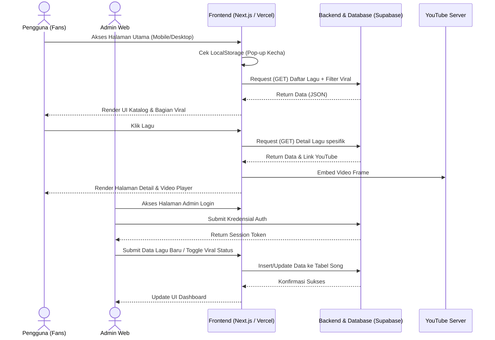
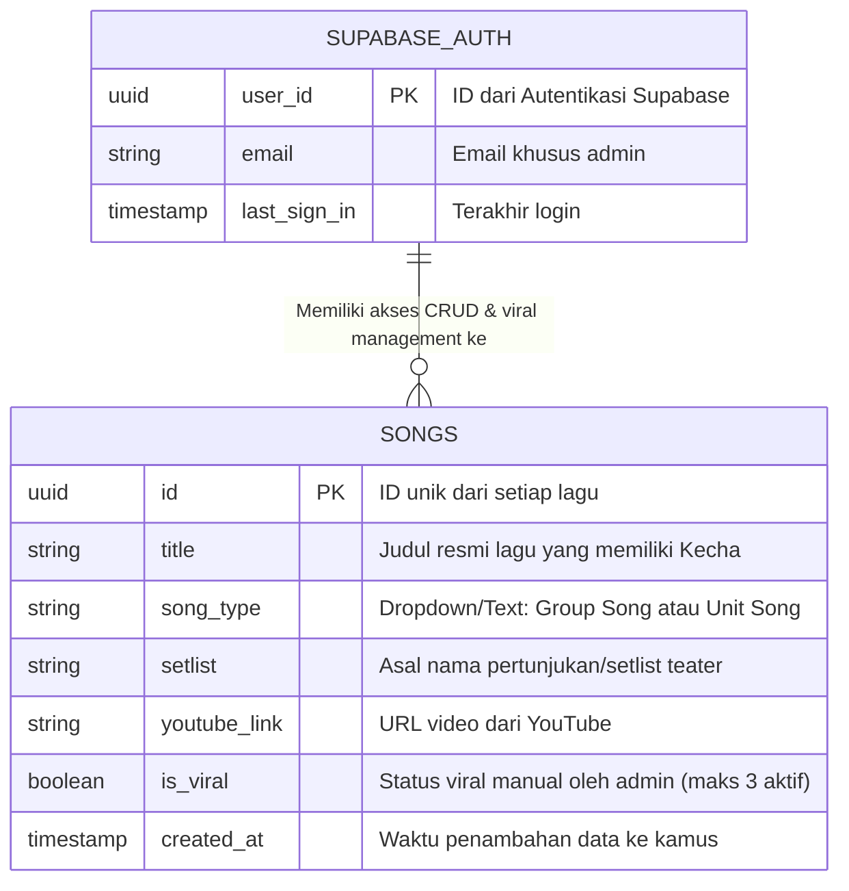

# PRD — Project Requirements Document

## 1. Overview
Penggemar JKT48 (fans) saat ini kesulitan dan harus mencari secara manual di internet untuk mengetahui lagu-lagu mana saja yang memiliki bagian *chant* khusus bernama "Kecha". Aplikasi ini dibangun sebagai sebuah kamus digital interaktif yang mengumpulkan dan mendata seluruh lagu JKT48 yang memiliki bagian "Kecha". 

Tujuan utama dari aplikasi ini adalah menjadi pusat data (*all-in-one resource*) yang memudahkan fans mencari informasi historis lagu lama, mengetahui detail lagu (seperti dari setlist apa dan tipe lagunya), serta langsung dapat menonton preview "Kecha" melalui tayangan YouTube. Aplikasi ini juga dirancang dengan pendekatan *mobile-first* mengingat mayoritas penggemar mengakses konten melalui perangkat ponsel.

## 2. Requirements
- **Akses Publik Tanpa Login:** Pengguna dapat langsung membuka aplikasi dan melihat seluruh katalog lagu tanpa perlu membuat akun.
- **Role Admin Terotentikasi:** Terdapat sistem login khusus bagi admin untuk mengelola (menambahkan, mengubah, menghapus, dan mengatur status viral) data lagu.
- **Edukasi Pengguna Baru:** Aplikasi harus memiliki *pop-up notification* untuk pengunjung yang pertama kali datang, berisi penjelasan apa itu "Kecha" beserta video preview (tanpa *auto-play*), yang dapat diatur agar tidak muncul lagi di hari yang sama.
- **Desain Mobile-First & Responsif:** Antarmuka wajib dioptimalkan secara prioritas untuk perangkat ponsel. Layout harus responsif, menggunakan tap-target yang memadai, navigasi yang nyaman di layar kecil, performa cepat di jaringan seluler, dan pengujian ketat di berbagai ukuran layar modern.
- **Panduan Desain Visual:** Aplikasi harus bersih dari kesan "AI-generated" dengan **TIDAK MENGGUNAKAN WARNA GRADASI**. Palet warna flat yang diwajibkan adalah:
  - Primary: `#B71C2B`
  - Secondary: `#2B2D31`
  - Background: `#F8F6F3`
  - Surface: `#F2EFEA`
  - Text: `#1C1E21`
- **Animasi & Elemen UI:** Seluruh pergerakan halaman dan komponen wajib menggunakan animasi yang *smooth* dari library `motion.dev`, serta menggunakan komponen antarmuka dari `Untitled UI`.

## 3. Core Features
- **Bagian Lagu Viral Terbaru:** Bagian khusus di bagian atas halaman utama yang menampilkan 3 lagu pilihan admin yang sedang tren/diperbincangkan. Tampilan akan menggunakan komponen kartu (card) yang menonjol dengan label "Viral/Kecha" dan tombol akses cepat ke halaman detail. Admin dapat mengubah susunan atau menonaktifkan status viral secara manual melalui dashboard.
- **Pop-up Penjelasan Kecha:** Modal informasi interaktif saat pertama kali *load* website, lengkap dengan video non-autoplay dan opsi "Jangan tampilkan lagi hari ini" (berbasis *local storage/cookies* browser).
- **Kamus/Katalog Lagu Utama:** Halaman *homepage* yang menampilkan daftar lengkap judul lagu yang memiliki *part* Kecha secara rapi, disusun secara kronologis atau alfabetis.
- **Halaman Detail Lagu (First Win):** Halaman khusus saat pengunjung mengklik lagu yang memuat detail nama lagu, tipe lagu (*Group Song* atau *Unit Song*), nama *setlist*, dan area pemutar video preview YouTube terintegrasi.
- **Dashboard Admin (CRUD & Viral Management):** Halaman terproteksi bagi admin untuk menambah lagu baru, memperbarui link video, mengedit detail setlist lagu, serta mengelola status "Viral" (maksimal 3 lagu aktif dalam satu waktu) untuk ditampilkan di bagian atas homepage.

## 4. User Flow
**Alur Pengguna Anonim (Fans):**
1. Pengguna membuka alamat website (via ponsel atau desktop).
2. Muncul *Pop-up* penjelasan "Kecha". Pengguna menonton video penjelasan, mencentang "Jangan tampilkan lagi hari ini", lalu menutup *pop-up*.
3. Pengguna melihat bagian **Lagu Viral Terbaru** di atas, lalu melihat daftar katalog lagu di bawahnya.
4. Pengguna mengklik salah satu lagu (viral atau biasa).
5. Pengguna diarahkan ke halaman Detail, melihat informasi lagu (tipe & setlist), dan memutar preview YouTube.

**Alur Admin:**
1. Admin mengakses URL khusus (contoh: `/admin/login`).
2. Admin memasukkan kredensial login.
3. Diarahkan ke Dashboard Admin.
4. Admin mengklik tombol "Tambah Lagu Baru", mengisi formulir (Judul, Tipe, Setlist, Link YouTube), dan menyimpannya.
5. Untuk mengatur lagu viral, admin membuka daftar lagu dan mengaktifkan toggle "Tampilkan sebagai Viral" pada lagu yang diinginkan. Sistem akan membatasi maksimal 3 lagu aktif. Jika lagu ke-4 diaktifkan, lagu pertama akan otomatis dinonaktifkan (atau admin menerima notifikasi pembatasan).
6. Perubahan data lagu dan status viral otomatis tersinkronisasi dan langsung tampil di halaman utama publik.

## 5. Architecture
Aplikasi ini menggunakan arsitektur modern berbasis jamstack. Frontend (Next.js) akan menangani *routing*, animasi (motion.dev), antarmuka (Untitled UI), penyimpanan status lokal (untuk *Pop-up*), dan rendering responsif *mobile-first*. Supabase bertindak sebagai Backend-as-a-Service (BaaS) yang menyediakan Database PostgreSQL dan solusi Autentikasi untuk Admin. Vercel bertugas sebagai tempat *hosting* yang akan melayani pengunjung secara global dengan performa tinggi.

## 6. Database Schema
Aplikasi ini menggunakan skema relasional yang sederhana, di mana manajemen *User/Admin* dikelola langsung oleh sistem *Auth* bawaan Supabase, dan data lagu disimpan di tabel publik khusus.

**Tabel: `songs`**
- `id` (UUID) - Primary Key.
- `title` (Text) - Judul lagu.
- `song_type` (Text) - Menyimpan nilai tipe lagu (contoh: "Group Song", "Unit Song").
- `setlist` (Text) - Nama setlist asal lagu tersebut (contoh: "Aturan Anti Cinta").
- `youtube_link` (Text) - Tautan URL untuk di-embed pada halaman detail.
- `is_viral` (Boolean) - Status manual oleh admin untuk menampilkan lagu di bagian "Viral". Dibatasi maksimal 3 lagu dengan nilai `true` dalam satu waktu untuk menjaga kualitas tampilan.
- `created_at` (Timestamp) - Waktu pencatatan.

**Tabel: `admin_users`** *(Virtual/Managed by Supabase Auth)*
- Menyimpan kredensial admin secara aman tanpa perlu dibangun dari nol.

## 7. Tech Stack
Berikut adalah teknologi yang ditetapkan untuk membangun aplikasi ini:
- **Frontend Framework:** Next.js (React) dengan pendekatan *Mobile-First* dalam struktur routing dan page layout.
- **UI Components:** Untitled UI (Digunakan untuk struktur *button*, *cards*, *forms*, dll)
- **Animations:** `motion.dev` (Framer Motion) untuk transisi halaman dan interaksi yang mewah namun ringan.
- **Styling:** Tailwind CSS (Harus dikonfigurasi ketat mengikuti palet warna *Flat/Solid* yang ditentukan, sangat dilarang menggunakan kelas gradasi seperti `bg-gradient-to-*`. Penulisan CSS mengutamakan breakpoint mobile `sm/md/lg` sebagai dasar).
- **Backend, Database, & Auth:** Supabase (PostgreSQL & Supabase Auth).
- **Deployment:** Vercel (Menjamin *CI/CD pipeline* yang lancar dengan Next.js dan optimasi edge network untuk akses global).